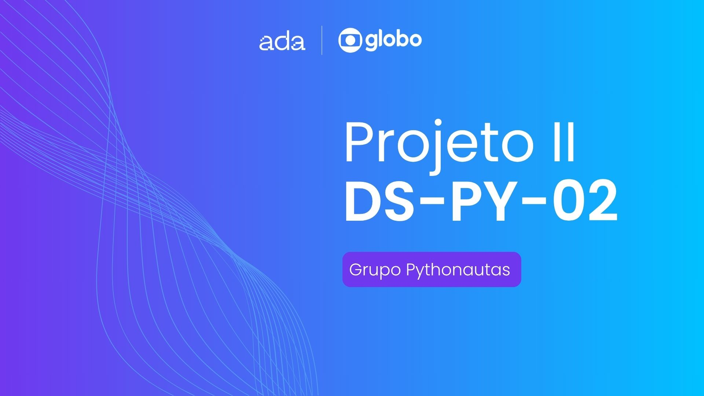
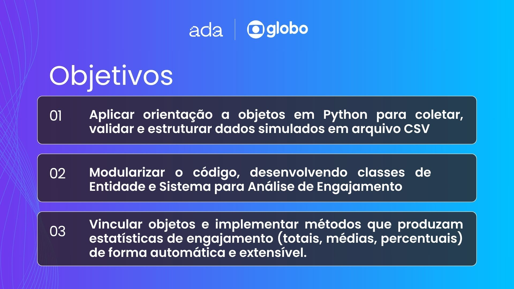
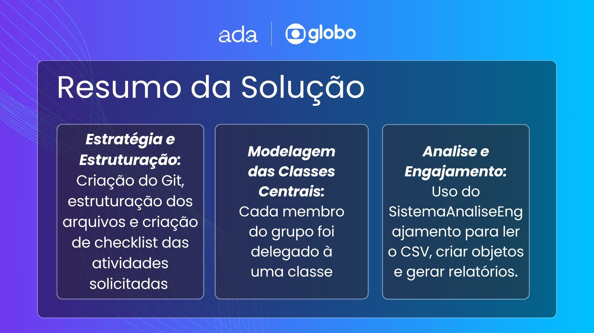
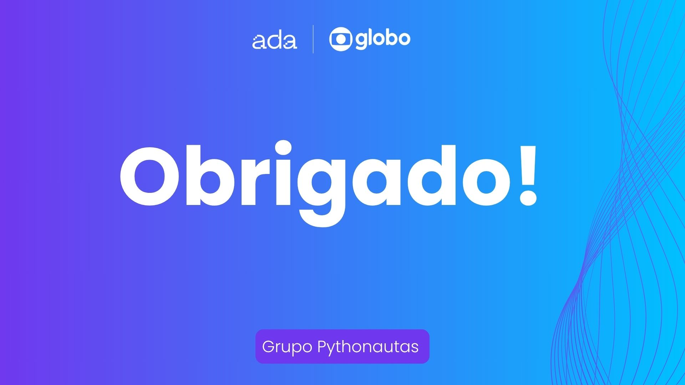

# 🤝 Ada x Globotech — Projeto II: Análise de Engajamento de Mídias Globo com POO

Este repositório contém o desenvolvimento do **Projeto II** do desafio **Ada Tech x Globotech**, uma iniciativa que simula experiências reais do mercado de tecnologia por meio de projetos em equipe.



Neste segundo projeto, o grupo aplicou os conceitos de **Programação Orientada a Objetos (POO)** com **Python**, visando construir um sistema modular e robusto para análise de engajamento de conteúdos em plataformas do ecossistema Globo, como Globoplay, G1 e outros.

---

## 👥 Integrantes do grupo

- [@falk-dev](https://github.com/falk-dev)
- [@aliceochoa](https://github.com/aliceochoa)
- [@Williannca85](https://github.com/Williannca85)
- [@devrsmenezes](https://github.com/devrsmenezes)
- [@isabelacmaia](https://github.com/isabelacmaia)
- [@ugabiraposo](https://github.com/ugabiraposo)

---

## 💡 Sobre o Projeto

### 📌 Tema  
**Análise de Engajamento de Mídias Globo com Orientação a Objetos**

### 🎯 Objetivo  
Desenvolver um sistema orientado a objetos capaz de processar e analisar interações de usuários com diferentes tipos de conteúdo digital (vídeos, podcasts e artigos), fornecendo relatórios completos de engajamento e comportamento nas plataformas digitais da Globo.

---

## 🛠️ Principais funcionalidades

- **Modelagem de entidades** com POO: `Plataforma`, `Conteudo` (e subclasses: `Video`, `Podcast`, `Artigo`), `Interacao`, `Usuario`.
- **Sistema central**: `SistemaAnaliseEngajamento`, responsável por orquestrar o carregamento dos dados, vinculação entre objetos e geração de análises.
- **Relatórios analíticos**:
  - Total de interações por tipo
  - Comentários realizados
  - Tempo médio e total de consumo
  - Conteúdos mais engajados
  - Plataformas mais utilizadas por usuário
- **Estrutura modular** com pacotes organizados:
  - `entidades/`: classes de domínio
  - `analise/`: lógica de processamento
  - `main.py`: ponto de entrada do sistema

---

## 🧠 Aprendizados

- Aplicação de **princípios sólidos da POO** em Python.
- Organização de código com módulos e pacotes reutilizáveis.
- Tratamento e validação de dados reais a partir de arquivos `.csv`.
- Trabalho em equipe utilizando Git e GitHub de forma colaborativa.
- Análise de dados para tomada de decisão baseada em métricas.

---

## ▶️ Como executar

1. Clone o repositório:
  ```bash
   git clone https://github.com/falk-dev/projeto-ii-ada-globotech.git
   cd projeto-ii-ada-globotech
  ```

2. Execute o sistema:
```bash
python main.py
```

## 📑 Apresentação & Review
Abaixo você encontra os slides que apresentamos durante nossa entrega: os objetivos de aprendizagem, o escopo inicial, as métricas calculadas, os principais desafios que enfrentamos e, por fim, nossos agradecimentos.








---